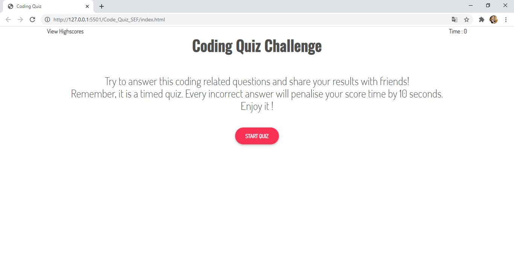
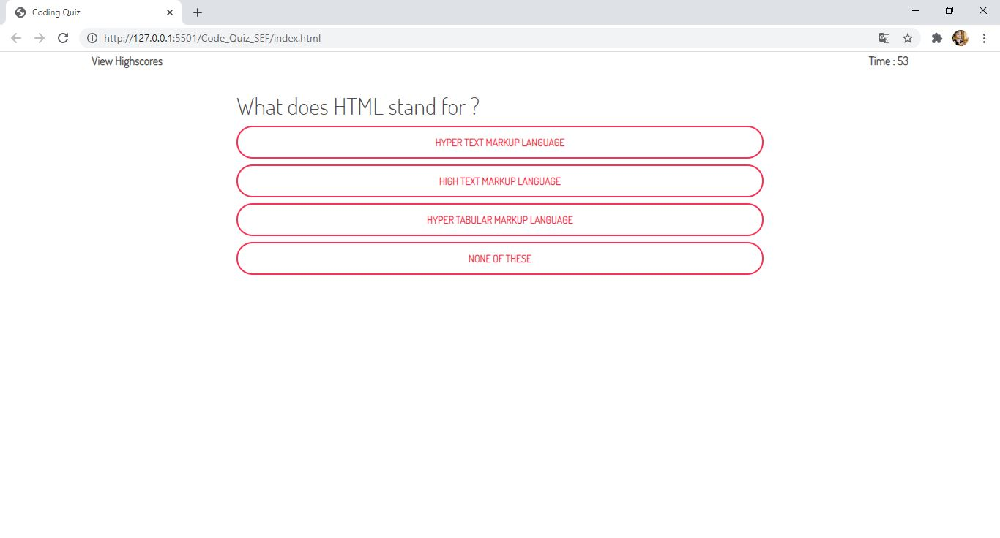
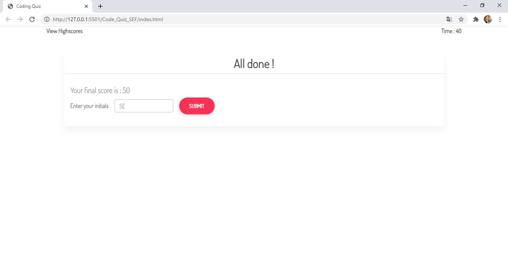
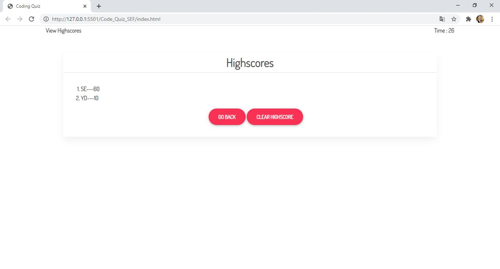
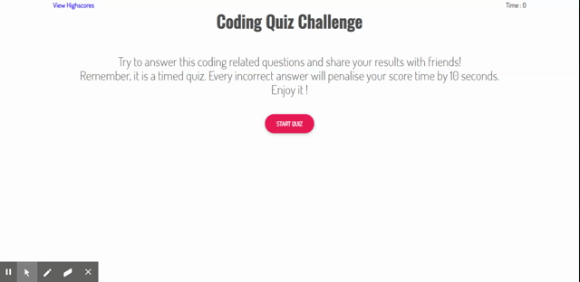

# Code_Quiz_SEF 
-----------------------------------------------------------------------------------------------------------------------
Table of content :

1. The purpose
2. The method
3. HTML file
4. CSS file
5. Bootsrap framework
6. JavaScript file
7. Demonstration
8. URLs 

-----------------------------------------------------------------------------------------------------------------------

## 1. The purpose :

The main purpose of this project is to build a timed coding quiz with multiple-choice questions. This app will run in the browser, and will feature dynamically updated HTML and CSS powered by JavaScript.

-----------------------------------------------------------------------------------------------------------------------

## 2. The method : 

    This website is created using the following languages, libraries and software.

    * HTML files : index.html.
    * JavaScript file: script.js
    * CSS file : style.css
    * Bootstrap framework
    * VS Code
    * Github
   
-----------------------------------------------------------------------------------------------------------------------

## 3. HTML file : 
    
    This file is created according to the standards.

    * Using sementics
    * Using consistently indentation and spacing
    * Using links to link the HTML file to other files (CSS and JavaScript files)
    * Using external links to link the HTML file to Bootstrap and Google Fonts 
    * Commenting the code
-----------------------------------------------------------------------------------------------------------------------

## 4. CSS file : 

This file is used to personalise the styles by creating new classes and ids.

    The main CSS properties used in this website are :
    
    * Font : font-family, font-weight
    * Display :  none, inline-block
    * list-style-type : none
    
-----------------------------------------------------------------------------------------------------------------------

## 5. Bootsrap framework : 

This open-source framework is used to style the website and make it reponsive. 

    The main Bootsrap components used in this website are :

    * Grid-system : container, rows and columns (.container, .row, .col)
    * Margin and padding : .m, .p, .ms, .mt, .me, .mb
    * Card : .card, .card-body, card-header
    * Button : .btn, .btn-danger, .btn-lg, .btn-rounded

-----------------------------------------------------------------------------------------------------------------------

## 6. JavaScript file : 

This file is used to create a dynamic website using functions.

    The main JavaScript properties and methods used in this website are :
    
    * HTML DOM : .document.getElementById() , .addEventListener(), .preventDefault(), .classList.add(), .classList.remove(), .setInterval(), .clearInterval(), ..setAttribute(), .document.createElement(), .appendChild(), .forEach(), .querySelectorAll(), .document.querySelector(), .append(), .localStorage.setItem(), localStorage.getItem(), location.reload(), .clear()
    * Conditions : if statements
    * JSON Methods : .stringify() Method, .parse Method
    * Personalised functions

-----------------------------------------------------------------------------------------------------------------------
## 7. Demonstration :
Screenshots :

Demo: 

-----------------------------------------------------------------------------------------------------------------------

## 8. URLs

* The URL of the deployed application : "https://saadiaelf.github.io/Code_Quiz_SEF/"

* The URL of the GitHub repository: "https://github.com/SaadiaELF/Code_Quiz_SEF.git"

-----------------------------------------------------------------------------------------------------------------------
